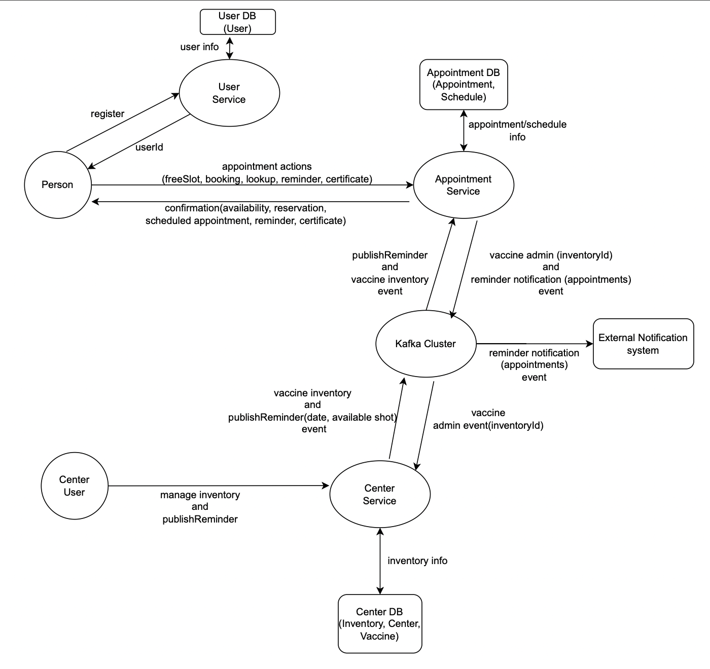

# Vaccination Application(Get Jabbed) built using Spring-Boot and Kafka

## Starting services locally without Docker

Every microservice is a Spring Boot application and can be started locally using IDE (Lombok plugin has to be set up) or ../mvnw spring-boot:run command. Please note that supporting services (Mysql Server) must be started before any other application (User, Appointments, Centre)

## Starting services locally with docker-compose
In order to start entire infrastructure using Docker, you have to build images by executing ./mvnw clean install -P buildDocker from a project root. Once images are ready, you can start them with a single command docker-compose up. Containers startup order is coordinated with dockerize script.

### Starting services locally with docker-compose and Java

If you experience issues with running the system via docker-compose you can try running the ./scripts/run_all.sh script that will start the infrastructure services via docker-compose and all the Java based applications via standard nohup java -jar ... command. The logs will be available under ${ROOT}/target/nameoftheapp.log.

## Understanding the Spring GetJabbed application

- Architecture diagram of the Spring Petclinic Microservices
 

## Database configuration
- In its default configuration, GetJabbed uses an mySql database (HSQLDB) which gets populated at startup with data.Dependency for Connector/J, the MySQL JDBC driver is already included in the pom.xml files.

## Start a MySql database
- You may start a MySql database with docker:

```
docker run -e MYSQL_ROOT_PASSWORD=petclinic -e MYSQL_DATABASE=GetJabbed -p 3306:3306 mysql:5.7.8

```
or download and install the MySQL database (e.g., MySQL Community Server 5.7 GA), which can be found here: https://dev.mysql.com/downloads/

### Use the Spring 'mysql' profile

To use a MySQL database, you have to start 3 microservices (`Appointment-service`, `center-service` and `user-services`)
with the `mysql` Spring profile. Add the `--spring.profiles.active=mysql` as programm argument.

By default, at startup, database schema will be created and data will be populated.
You may also manually create the GetJabbed database and data by executing the `"db/mysql/{schema,data}.sql"` scripts of each 3 microservices.
In the `application.yml` of the [Configuration repository], set the `initialization-mode` to `never`.

If you are running the microservices with Docker, you have to add the `mysql` profile into the (Dockerfile)[docker/Dockerfile]:
```
ENV SPRING_PROFILES_ACTIVE docker,mysql
```
In the `mysql section` of the `application.yml` from the [Configuration repository], you have to change
the host and port of your MySQL JDBC connection string. 


